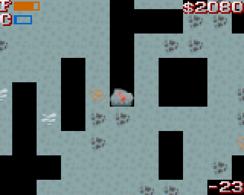
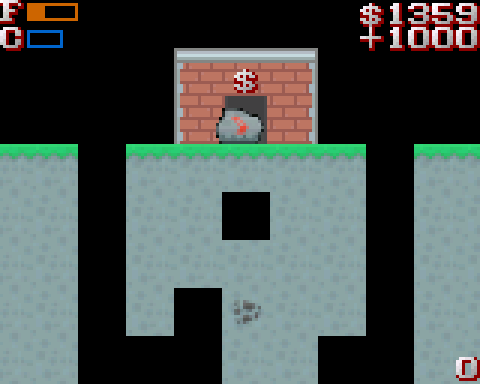
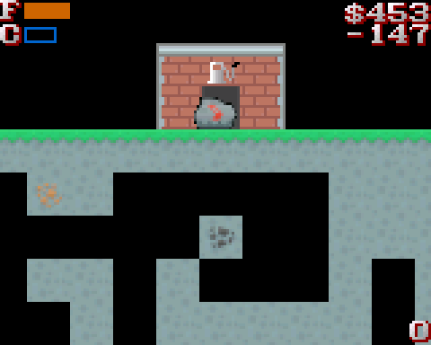
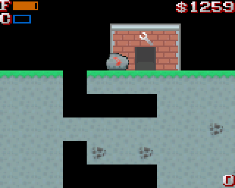
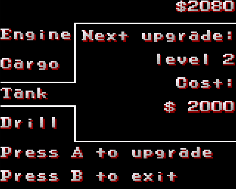
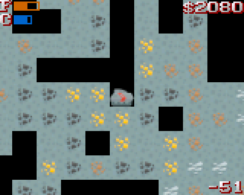
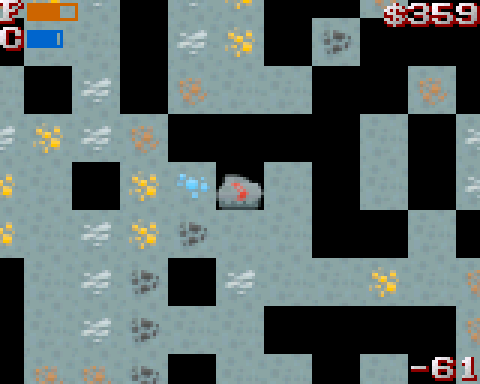
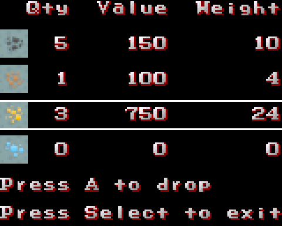

# Motherlode
A 2D excavation game for the [AdaFruit PyGamer](https://www.adafruit.com/product/4242)
inspired by the original [Motherload](http://www.xgenstudios.com/play/motherload) from XGen Studios.

Art from [kenney.nl](https://kenney.nl), font from [nfggames fontmaker](https://nfggames.com/games/fontmaker/).

# Installation

If you have PyGamer:
 - Connect the PyGamer to your computer with a good USB cable
 - Turn on the PyGamer
 - Double-click the reset button to enable the UF2 bootloader
 - A `PYGAMERBOOT` disk drive should appear on your computer
 - Download this file: [motherlode.uf2](https://github.com/Fabien-Chouteau/motherlode/releases/download/0.1.0/motherlode.uf2)
 - Drag and drop `motherlode.uf2` in the `PYGAMERBOOT` disk drive
 - After a short amount of time, the PyGamer will reboot and the game start

# Controls
 - `joystick up/left/right`: Fly the pod
 - `A + joystick down/left/right`: Use the drill
 - `select`: Enter and exit cargo menu

Use the drill to gather ores:

Sell it at the store:

You can then buy fuel:

And upgrades for your pod:

You will need a level 2 drill for gold and level 3 for diamonds:

If your pod is too heavy, press `select` to open the cargo menu and drop ores:

